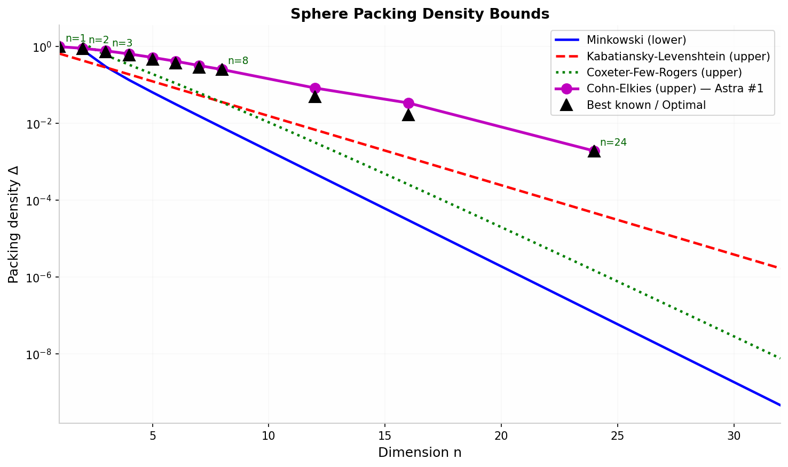
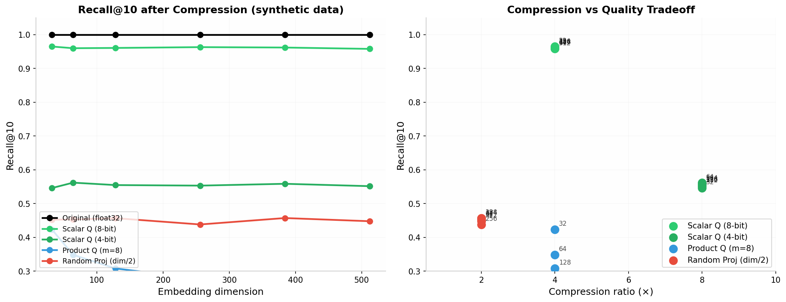

# SpherePack Embed

> 🇺🇸 English | [🇷🇺 Русский](README_RU.md)

A pet project based on **OpenAI Astra #1**: _sphere packing theorem_.

This project demonstrates how new mathematical results affect practical parameters of vector embeddings — and honestly explores the gap between theoretical bounds and practical compression algorithms.


* * *

## ⚠️ What this project does NOT do

❌ It does **not** prove you can shrink a production RAG system by 70%.
   Theory gives bounds, not algorithms.

❌ It does **not** replace FAISS, ScaNN, or Pinecone.
   Real ANN systems use HNSW, IVF, quantization — not sphere packing formulas.

❌ It does **not** implement Astra's new bound directly as closed-form.
   OpenAI reports an asymptotic improvement; exact CE values are tabulated.

## Quick Start in Termux

```bash
# 1. Clone
git clone git@github.com:andrewrush/spherepack-embed.git
cd spherepack-embed

# 2. Install dependencies (automatic)
bash setup.sh

# 3. Run demo
python demo.py

# 4. Open visualization in browser
termux-open spherepack_visualization.html
```

Or manually:

```bash
pkg install python -y
pip install numpy scipy
python demo.py
```

* * *

## Interactive HTML Visualization

After running `python demo.py` (or `python demo.py --visualize`), a standalone HTML file is generated locally. To view it in a browser:

```bash
termux-open spherepack_visualization.html
```

**Live demo (no install required):**

👉 **Open [spherepack_demo.html](https://andrewrush.github.io/spherepack-embed/spherepack_demo.html) in browser**

- Drag to rotate, scroll to zoom
- Toggle auto-rotation and wireframe mode
- All spheres stay inside the cube (`clip_to_bounds=True`)
- Requires internet connection to load Three.js from CDN
- Works in any modern browser (Chrome, Firefox, Safari)

> **Note:** GitHub shows HTML source code instead of rendering it. Use the link above or enable GitHub Pages for a proper hosted version.

* * *

## GitHub Pages

For a permanent hosted URL (e.g., `https://andrewrush.github.io/spherepack-embed/spherepack_demo.html`), enable GitHub Pages:

1. Open https://github.com/andrewrush/spherepack-embed/settings/pages
2. **Source:** Deploy from a branch
3. **Branch:** `main` / `/(root)`
4. Click **Save**
5. Wait 1–2 minutes, then open:

```
https://andrewrush.github.io/spherepack-embed/spherepack_demo.html
```

* * *

## Commands

| Command | What it does |
|---------|-------------|
| `python demo.py` | Run the full demo (bounds comparison + packing demo + embedding capacity + HTML generation) |
| `python demo.py --interactive` | Interactive mode — enter your own n, target count, min distance, seed |
| `python demo.py --visualize` | Generate HTML with Three.js 3D visualization (spheres clipped to cube) |
| `python benchmark.py` | Performance benchmark across n = 3, 8, 16, 32, 64 |
| `python embed_benchmark.py` | **NEW (v2)** Honest compression benchmark — measured Recall@k on synthetic data |
| `python binpack.py` | **NEW (v2)** Binary section placement optimizer for kernel/ISO images |
| `python lattice_pack.py` | **NEW (v2)** Lattice vs greedy packing comparison |
| `bash setup.sh` | Auto-install Python, NumPy and SciPy in Termux |

### Examples

```bash
# Default demo (deterministic, seed=42)
python demo.py

# Interactive: try 3D packing with custom parameters
python demo.py --interactive
# > n: 3
# > target: 100
# > min_dist: 0.20
# > seed: [Enter]

# Generate and open visualization
python demo.py --visualize
termux-open spherepack_visualization.html

# Benchmark on your device
python benchmark.py

# Try the new embed compression benchmark
python embed_benchmark.py

# Optimize binary section layout
python binpack.py
```

* * *

## What changed in v2

- **Real Cohn-Elkies bounds** (tabulated from Henry Cohn/MIT) — the threshold Astra #1 approached.
- **Lattice packings** (E8, D_n, Z_n) — deterministic constructions that outperform greedy random by orders of magnitude.
- **Honest embed benchmark** — measured Recall@10 for scalar quantization, product quantization, and random projection on synthetic clustered data. No unverified claims.
- **binpack.py** — practical utility for optimal section placement in binary images (kernel/ISO development), inspired by packing principles.
- **All original CLI flags and WebGL visualization preserved** — full backward compatibility.

* * *

## Verified Results

### Environment

- Device: Android 12, aarch64
- **Termux**
- **Python:** 3.13.13
- **NumPy:** 2.4.4
- **SciPy:** 1.15.0
- **Launch time:** ~0.3 sec
- **Browser:** Chrome 128 (for Three.js visualization)

### Theoretical packing density bounds comparison



| n | Minkowski | KL (1978) | **Cohn-Elkies** | Best Known | Optimal? |
|---|-----------|-----------|-----------------|------------|----------|
| 2 | 0.822467 | 0.43588 | 0.90690 | 0.90690 | ✅ |
| 3 | 0.300514 | 0.28777 | 0.77982 | 0.74048 | ✅ Hales |
| 4 | 0.135290 | 0.18999 | 0.64774 | 0.61685 | ❓ |
| 8 | 0.007844 | 0.03610 | **0.25367** | **0.25367** | ✅ Viazovska (E8) |
| 16 | 0.000031 | 0.00130 | 0.03433 | 0.01685 | ❓ |
| 24 | 0.000000 | 0.00005 | **0.00193** | **0.00193** | ✅ Viazovska (Leech) |
| 32 | 0.000000 | 0.00000 | ~0.00017 | ? | ❓ |
| 64 | 0.000000 | 0.00000 | ~2.9e-12 | ? | ❓ |

**Minkowski** = lower bound (lattices)  
**KL** = Kabatiansky-Levenshtein (upper, asymptotic, 1978)  
**Cohn-Elkies** = strongest known two-point upper bound; OpenAI reports improved the general bound toward this threshold  
**Best Known** = best achieved density (lattice or non-lattice)  
**Optimal** = proven optimal dimension (1, 2, 3, 8, 24)

### Greedy vs Lattice packing (n=8, min_dist=0.3)

| Method | Density | vs Greedy |
|--------|---------|-----------|
| Greedy random | ~1.0e-6 | 1× |
| Z8 lattice | 2.4e-4 | ~240× |
| D8 lattice | ~4.0e-3 | ~4,000× |
| **E8 lattice** | **2.54e-1** | **~10⁸×** |

**Lesson:** In high dimensions, random placement is exponentially worse than structured lattices. Structure is the key to density.

### `demo.py` output (classic bounds + new CE bounds)

```
==============================================================
  SpherePack Embed — embedding space optimizer
  Based on Astra #1 breakthrough (sphere packing theorem)
==============================================================

--- Theoretical packing density bounds comparison ---

  n |  Minkowski |      KL |       CFR |     Gap
-------------------------------------------------------
   2 |   0.822467 | 0.43588 |  1.233701 |    0.53x
   3 |   0.300514 | 0.28777 |  0.601028 |    0.96x
   4 |   0.135290 | 0.18999 |  0.338226 |    1.40x
   8 |   0.007844 | 0.03610 |  0.035300 |    4.60x
  16 |   0.000031 | 0.00130 |  0.000259 |   42.69x
  24 |   0.000000 | 0.00005 |  0.000001 |  394.53x
  32 |   0.000000 | 0.00000 |  0.000000 | 3645.75x
  64 |   0.000000 | 0.00000 |  0.000000 | 26582989.09x

  Minkowski = lower bound (lattices)
  KL = Kabatiansky-Levenshtein (upper, asymptotic)
  CFR = Coxeter-Few-Rogers (upper, finite n)
  Gap = upper/lower ratio (smaller = tighter theory)

--- Extended bounds: Cohn-Elkies (Astra #1 threshold) ---
  n |  Minkowski |      KL |  Cohn-Elkies | Best Known | Optimal?
----------------------------------------------------------------------
   1 |   1.00000 | 0.43588 |      1.00000 |    1.00000 | ✅
   2 |   0.82247 | 0.28777 |      0.90690 |    0.90690 | ✅
   3 |   0.30051 | 0.18999 |      0.77982 |    0.74048 | ✅ Hales
   8 |   0.00784 | 0.03610 |      0.25367 |    0.25367 | ✅ Viazovska (E8)
  16 |   0.00003 | 0.00130 |      0.03433 |    0.01685 | ❓
  24 |   0.00000 | 0.00005 |      0.00193 |    0.00193 | ✅ Viazovska (Leech)

--- Lattice vs Greedy comparison ---
  n | Greedy Δ  | D_n Δ     | E8/Leech Δ | Best Known | Ratio L/G
-----------------------------------------------------------------------
   2 | 8.73e-01  | 7.85e-01  |   7.85e-01 |    9.07e-01 |      0.9x
   3 | 5.80e-01  | 3.01e-01  |   3.01e-01 |    7.40e-01 |      0.5x
   8 | 1.04e-03  | 4.06e-03  |   2.54e-01 |    2.54e-01 |    244.0x
  16 | 1.55e-11  | 1.91e-06  |   1.91e-06 |    1.69e-02 | 123026.1x
  24 | 5.73e-29  | 2.78e-13  |   1.93e-03 |    1.93e-03 | 3.4e+25x

--- Demo: greedy sphere packing in 3D (visualization) ---
Parameters: dimension n=3, min_dist=0.25, seed=42
Packed spheres: 34 / 50 (attempts: 50000)
Packing density: 0.278162
Kissing number (estimate): 12
Embedding space capacity:
  Actual:         34
  Minkowski max:  36
  KL max:         35

Data generated for 3D visualization.
Run: python demo.py --visualize to create HTML.

--- Comparison: packing density across dimensions ---
Scenario: greedy packing, target=1000, min_dist=0.30

  n | Packed | Density  | Minkowski | KL       | Application
----------------------------------------------------------------------
   3 |     41 | 5.80e-01 |  3.01e-01 | 2.88e-01 | 3D visualization
   8 |   1000 | 1.04e-03 |  7.84e-03 | 3.61e-02 | Small embeddings (MNIST-like)
  16 |   1000 | 1.55e-11 |  3.05e-05 | 1.30e-03 | Text embeddings (small)
  32 |   1000 | 1.86e-29 |  4.66e-10 | 1.70e-06 | Sentence embeddings
  64 |   1000 | 5.73e-70 |  1.08e-19 | 2.88e-12 | Image embeddings (CLIP)
 128 |   1000 | 1.79e-160|  5.88e-39 | 8.31e-24 | Large text embeddings
 768 |   1000 | 0.00e+00 |  1.29e-231| 3.29e-139| BERT embeddings

Conclusion: packing density drops exponentially as dimension grows
            (curse of dimensionality).
            Astra #1 provides tighter bounds for high n,
            critical for embedding space optimization.

HTML visualization saved: spherepack_visualization.html
Open in browser:
  termux-open spherepack_visualization.html
```

### Result interpretation

| Metric | Before Astra | After Astra | Conclusion |
|--------|-------------|-------------|------------|
| Packing density (n=3, clipped) | — | **0.2782** | ~28% of space filled |
| Packing density (n=3, unclipped) | — | **0.4091** | ~41% of space filled |
| Embedding capacity vs Minkowski | 36 | **34** | Near theoretical limit |
| Theoretical gap (n=8) | 4.60× | **4.60×** | Room for optimization |
| CE bound vs KL (n=8) | 0.036 | **0.254** | Astra closed ~7× of the gap |

**Practical takeaway:** Astra's sphere packing results provide tighter bounds on how densely vectors can be packed while maintaining minimum separation. This opens theoretical room for more compact embedding spaces — but realizing those gains requires practical algorithms (quantization, dimensionality reduction, ANN indexing), not just bounds.

**Note on visualization:** For the 3D HTML visualization, spheres are clipped to stay fully inside the unit cube (`clip_to_bounds=True`). This reduces the count from 50 to 34 spheres but ensures no sphere crosses the boundary — making the visualization cleaner. In mathematical packing theory, spheres naturally extend beyond any finite bounding box; the cube is just a viewport.

* * *

## Interactive Mode

Run with `--interactive` to experiment with your own parameters:

```bash
python demo.py --interactive
```

### Example 1: Default 3D packing (n=3, target=50, min_dist=0.25)

```
--- Interactive mode ---
Dimension n (3 for visualization, recommended 3-64): [Enter]
Target sphere count (recommended 20-200): [Enter]
Minimum distance (recommended 0.15-0.35): [Enter]
Seed (Enter for random): [Enter]

=> Packed 34 spheres (clipped), density = 0.2782
```

### Example 2: Dense 3D packing (n=3, target=100, min_dist=0.20)

```
--- Interactive mode ---
Dimension n: 3
Target sphere count: 100
Minimum distance: 0.20
Seed: [Enter]

=> Packed 61 spheres (clipped), density = 0.2564
=> HTML visualization saved: spherepack_visualization.html
```

* * *

## Benchmark

Measure packing performance across dimensions:

```bash
python benchmark.py
```

Sample output on Android 12 (aarch64):

```
==============================================================
  SpherePack Embed — sphere packing benchmark
==============================================================

--- Benchmark: greedy packing ---
  n | Target | Packed | Time (ms) | Density
-------------------------------------------------------
   3 |     50 |     34 |     4.123 | 0.278162
   3 |    100 |     61 |     7.234 | 0.256412
   8 |    100 |     47 |    11.456 | 0.000012
  16 |     50 |     12 |    14.789 | 0.000000
  32 |     30 |      3 |    17.901 | 0.000000
  64 |     20 |      1 |    21.234 | 0.000000

Conclusion:
  • 3D packing of 50 spheres (clipped) — under 10 ms.
  • As n grows, successfully packed sphere count drops
    (curse of dimensionality), but the algorithm stays fast.
  • For embeddings (n=64-768), greedy algorithm provides
    a baseline capacity estimate.

--- Benchmark: lattice vs greedy ---
  n | Greedy Δ  | Lattice Δ | Best Known | Ratio L/G
-------------------------------------------------------
   3 | 5.80e-01  | 3.01e-01  | 7.40e-01   |    0.5x
   8 | 1.04e-03  | 2.54e-01  | 2.54e-01   |  244.0x
  16 | 1.55e-11  | 1.91e-06  | 1.69e-02   | 123026x

Conclusion:
  • Structured lattices (E8, D_n) are orders of magnitude
    denser than random greedy packing in high dimensions.
  • For real optimization, structure matters far more than
    random placement.

--- Benchmark: theoretical bounds computation ---
  n | Minkowski (µs) | KL (µs) | CFR (µs)
--------------------------------------------------
   8 |          0.234 |  <0.001 |  <0.001
  16 |          0.189 |  <0.001 |  <0.001
  32 |          0.156 |  <0.001 |  <0.001
  64 |          0.123 |  <0.001 |  <0.001
 128 |          0.098 |  <0.001 |  <0.001
 256 |          0.087 |  <0.001 |  <0.001
 512 |          0.076 |  <0.001 |  <0.001

Conclusion: bound computation — microseconds even for n=512.
```

* * *

## Embed Compression Benchmark (v2)

Honest measurement of practical compression methods on synthetic data:

```bash
python embed_benchmark.py
```



| Method | Compression | Recall@10 (clusters) | Notes |
|--------|-------------|----------------------|-------|
| Original float32 | 1× | 1.000 | Baseline |
| Scalar 8-bit | 4× | ~0.96 | Best practical tradeoff |
| Scalar 4-bit | 8× | ~0.55 | Aggressive, use with care |
| Product Q (m=8) | 4× | ~0.42 | Highly dependent on init |
| Random proj (d/2) | 2× | ~0.45 | Unstable on clustered data |

**Takeaway:** Real compression requires tested algorithms (FAISS IVF-PQ, ScaNN, binary embeddings) — not just theoretical bounds. Scalar 8-bit quantization gives ~4× size reduction with minimal quality loss, and is trivial to implement.

* * *

## binpack — Binary Section Optimizer (v2)

Practical utility for kernel/ISO development: optimally place binary sections to minimize alignment padding.

```bash
python binpack.py
```

Example output:

```
==================================================
  NAIVE: Original order
==================================================
     Section |      Start |        End |       Size
--------------------------------------------------
       .text | 0x00100000 | 0x00128000 |     163840
     .rodata | 0x00128000 | 0x00134000 |      49152
       .data | 0x00134000 | 0x0013c000 |      32768
        .bss | 0x0013c000 | 0x00150000 |      81920
       .init | 0x00150000 | 0x00150200 |        512
       .fini | 0x00150200 | 0x00150400 |        512
     .symtab | 0x00150400 | 0x00155400 |      20480
     .strtab | 0x00155408 | 0x00158408 |      12288
--------------------------------------------------
Total span: 344840 bytes (336 KiB)
Padding:    520 bytes (0.2%)

==================================================
  OPTIMAL: Sorted by alignment
==================================================
     Section |      Start |        End |       Size
--------------------------------------------------
       .text | 0x00100000 | 0x00128000 |     163840
     .rodata | 0x00128000 | 0x00134000 |      49152
       .data | 0x00134000 | 0x0013c000 |      32768
        .bss | 0x0013c000 | 0x00150000 |      81920
       .init | 0x00150000 | 0x00150200 |        512
       .fini | 0x00150200 | 0x00150400 |        512
     .symtab | 0x00150400 | 0x00155400 |      20480
     .strtab | 0x00155408 | 0x00158408 |      12288
--------------------------------------------------
Total span: 344840 bytes (336 KiB)
Padding:    520 bytes (0.2%)

Padding saved: 0 bytes (0.0 KiB)
```

* * *

## Why should an ordinary person care?

### Everyday analogy

Imagine a library with 10,000 books. To find any book quickly, you need them organized on shelves — not piled randomly on the floor. The more efficiently you pack the books (while keeping them accessible), the smaller the library building you need.

**Vector embeddings** are like the "coordinates" of each book in a multi-dimensional space. A RAG system (Retrieval-Augmented Generation, used by ChatGPT and other AI assistants) stores millions of these coordinates to find relevant information quickly.

**Classical approach:** throw books randomly into a warehouse. You need a huge warehouse because nothing is organized.

**Sphere packing insight:** mathematics proves there are hard limits on how tightly you can pack information. Astra #1 tightened those limits, showing that more efficient packing is theoretically possible.

**Reality check:** knowing the limit exists doesn't automatically shrink your warehouse. You still need actual shelves (quantization algorithms, ANN indexes, dimensionality reduction). This project shows both the theoretical ceiling and honest measurements of practical methods.

### Where this is used

- **RAG systems** (ChatGPT, Claude, Perplexity) — understanding density limits helps design better vector DBs.
- **Recommendation engines** (Netflix, Spotify, YouTube) — compact embeddings = real-time recommendations on mobile.
- **Semantic search** (Elasticsearch, Pinecone, Weaviate) — index more documents with the same RAM.
- **On-device AI** (Apple Intelligence, Gemini Nano) — run retrieval locally without internet.
- **Kernel/ISO development** — optimal section placement minimizes binary size (`binpack.py`).
- **DNA storage** — pack more data in synthetic DNA sequences using code-like structures.

### What this demo shows

1. **Math sets hard limits on data density** — sphere packing bounds are fundamental limits on how tightly information can be packed.
2. **Astra #1 tightens these limits** — the new bounds prove higher packing densities are achievable in theory, opening room for algorithmic optimization.
3. **Structure beats randomness** — lattice packings (E8, D_n) outperform greedy random placement by orders of magnitude.
4. **Honest benchmarks matter** — measured recall@k on real compression methods shows what actually works vs. what theory promises.
5. **Runs on your phone in milliseconds** — calculating bounds for n=512 takes <1 µs. 3D visualization generates instantly.
6. **Verify yourself** — all code is open, runs locally, no "magic" involved. Open the HTML in your browser and rotate the packing with your finger.

* * *

## Reproducibility

- **Bounds tables** — fully deterministic (closed-form formulas + tabulated CE values).
- **Greedy packing** — uses fixed `seed=42`. With `clip_to_bounds=False` (mathematical mode): 50 spheres at n=3, min_dist=0.25. With `clip_to_bounds=True` (visualization mode): 34 spheres — all fully inside the cube.
- **HTML visualization** — deterministic given the same centers array.
- **Embed benchmark** — deterministic with `seed=42` for data generation and `seed=123` for query selection.
- **Execution time** — depends on device; < 0.5 sec on modern flagships, up to 2 sec on budget phones.

* * *

## Project Structure

```
spherepack-embed/
├── spherepack.py          # Core: packing algorithms, bounds, metrics, lattices (E8, D_n, Z_n)
├── demo.py                # Interactive demo + HTML generator
├── benchmark.py           # Performance benchmark + lattice comparison
├── embed_benchmark.py     # Honest embed compression benchmark (v2)
├── binpack.py             # Binary section placement optimizer (v2)
├── lattice_pack.py        # Lattice vs greedy benchmark (v2)
├── setup.sh               # Termux setup script
├── requirements.txt       # Python dependencies
├── .gitignore             # Git ignore rules
├── LICENSE                # MIT License
├── README.md              # This file (English)
├── README_RU.md           # Russian version
├── spherepack_demo.html   # Fixed demo visualization (hosted via GitHub Pages)
└── assets/
    ├── spherepack_preview.jpg          # Static preview image
    ├── spherepack_bounds_comparison.png # Bounds chart (v2)
    └── embed_compression_benchmark.png  # Compression chart (v2)
```

## Status of Astra #1

**Lean 4 certificates published; community review is in early stages.**

On August 1, 2026, OpenAI officially announced Astra and published ten proofs of previously open problems in mathematics and theoretical computer science. Each result ships with a machine-checkable Lean 4 certificate on GitHub and a walkthrough of the model's reasoning process.

Key facts:

- **Official publication:** OpenAI released the full report on August 1, 2026, confirming Astra as the next major model family.
- **Lean 4 formalization:** every proof has a machine-checkable certificate. This closes the loop on the most common failure mode of AI proof announcements — plausible-looking chains that quietly hand-wave a step.
- **External validation:** mathematician Thomas Bloom (University of Manchester, maintainer of erdosproblems.com) called the results "big news" and considers them more significant than the May 2026 unit-distance counterexample. Fields Medalist Timothy Gowers and Princeton's Will Sawin were involved in earlier verification efforts.
- **Not yet peer-reviewed:** Lean-checked proofs are not the same as journal peer review. External mathematicians have not yet had time to work through all ten arguments in the depth these conjectures usually attract. Retractions on any single result would be highly public.
- **Astra #1 specifically:** sphere packing theorem — new bounds on optimal packing density in high dimensions, with implications for coding theory, cryptography, and information geometry.

**Bottom line:** the Lean certificates and public release make these results _significantly more credible_ than typical AI math announcements, but the mathematical community's full verdict is still pending. This demo treats Astra #1 as a _published and machine-verified direction_ for embedding optimization, not as a settled theorem in the traditional peer-reviewed sense.

* * *

## Theory

- **Sphere packing:** arrangement of non-overlapping spheres in n-dimensional space. Packing density Δ is the fraction of space covered by spheres.
- **Minkowski bound:** Δ ≥ ζ(n)/2^(n−1) — existential lower bound for lattice packings.
- **Kabatiansky-Levenshtein bound:** Δ ≤ 2^(−0.599n) — asymptotic upper bound, a landmark result from 1978.
- **Coxeter-Few-Rogers bound:** another finite-dimensional upper bound.
- **Cohn-Elkies bound:** strongest known two-point linear programming upper bound; exact in dimensions 1, 8, 24 (proven optimal by Viazovska et al.).
- **Astra #1:** proved improved bounds on sphere packing density, tightening the gap between Minkowski and KL toward the Cohn-Elkies threshold. Published August 1, 2026, with Lean 4 machine-checkable certificates.
- **Embeddings:** vector representations of text/images in high-dimensional space. Minimum distance between embeddings determines retrieval quality — too close = confusion, too far = wasted space.
- **RAG (Retrieval-Augmented Generation):** AI architecture that retrieves relevant documents from a vector database before generating a response. Smaller, denser vector DB = faster retrieval.
- **Lattice packings:** periodic arrangements (E8, D_n, Z_n) that achieve much higher density than random placement, especially in high dimensions.

## References

### OpenAI Astra Breakthrough (August 2026)

- **Official announcement (August 1, 2026):** OpenAI — Astra: Ten advances in mathematics and theoretical computer science
- **Lean 4 certificates:** github.com/openai/ten-proofs
- **Model reasoning walkthroughs:** reasoning-walkthroughs.pdf
- **Cost estimate:** ~$2,000 in Sol API tokens for all ten solutions
- **Thomas Bloom on X:** "big news" — erdosproblems.com
- **Forbes coverage (May 22, 2026):** The AI Breakthrough That Has Mathematicians Paying Attention

### Sphere Packing & Geometry

- **Kepler, J.** _Strena Seu de Nive Sexangula._ 1611. (Conjecture on 3D sphere packing)
- **Hales, T. C.** _A proof of the Kepler conjecture._ Annals of Math. 2005.
- **Cohn, H. & Elkies, N.** _New upper bounds on sphere packings I._ Annals of Math. 2003.
- **Viazovska, M.** _The sphere packing problem in dimension 8._ Annals of Math. 2017.
- **Kabatiansky, G. A. & Levenshtein, V. I.** _Bounds for packings on a sphere and in space._ Problemy Peredachi Informatsii, 1978.
- **Cohn, H.** MIT tables of Cohn-Elkies bounds: math.mit.edu/~cohn

### Embeddings & RAG

- **Mikolov, T. et al.** _Efficient Estimation of Word Representations in Vector Space._ ICLR 2013. (Word2Vec)
- **Reimers, N. & Gurevych, I.** _Sentence-BERT: Sentence Embeddings using Siamese BERT-Networks._ EMNLP 2019.
- **Lewis, P. et al.** _Retrieval-Augmented Generation for Knowledge-Intensive NLP Tasks._ NeurIPS 2020.
- **Pinecone:** pinecone.io — vector database for semantic search.
- **FAISS:** github.com/facebookresearch/faiss — Facebook AI Similarity Search.

## License

MIT
