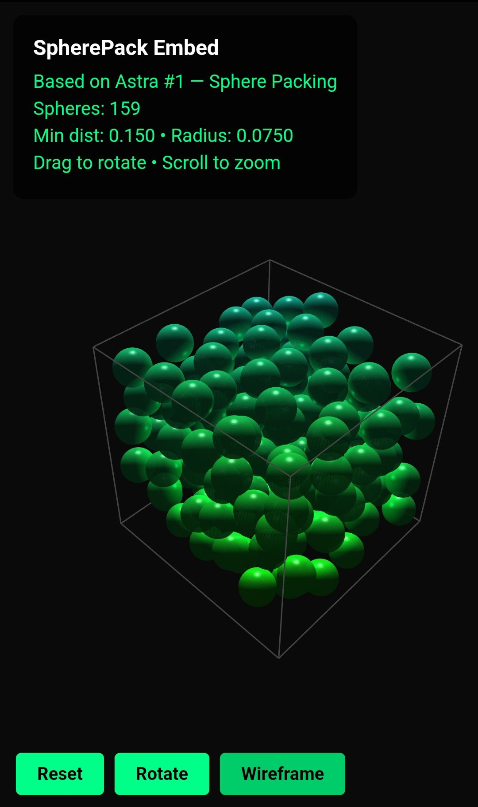

# SpherePack Embed

> [🇺🇸 English](README.md) | 🇷🇺 Русский

Pet-проект на основе **OpenAI Astra #1**: _теорема упаковки шаров_.

Этот проект демонстрирует, как новые математические результаты влияют на практические параметры векторных embeddings — и честно исследует разрыв между теоретическими границами и практическими алгоритмами сжатия.



* * *

## ⚠️ Что этот проект НЕ делает

❌ **Не** доказывает, что вы сожмёте production RAG на 70%.
   Теория даёт границы, не алгоритмы.

❌ **Не** заменяет FAISS, ScaNN или Pinecone.
   Реальные ANN-системы используют HNSW, IVF, квантизацию.

❌ **Не** реализует новую границу Astra в замкнутой форме.
   OpenAI сообщает об асимптотическом улучшении; точные значения CE — табличные.

## Быстрый старт в Termux

```bash
# 1. Клонировать
git clone git@github.com:andrewrush/spherepack-embed.git
cd spherepack-embed

# 2. Установить зависимости (автоматически)
bash setup.sh

# 3. Запустить демо
python demo.py

# 4. Открыть визуализацию в браузере
termux-open spherepack_visualization.html
```

Или вручную:

```bash
pkg install python -y
pip install numpy scipy
python demo.py
```

* * *

## Интерактивная HTML-визуализация

После запуска `python demo.py` (или `python demo.py --visualize`) генерируется автономный HTML-файл. Для просмотра в браузере:

```bash
termux-open spherepack_visualization.html
```

**Живая демо (установка не требуется):**

👉 **Откройте [spherepack_demo.html](https://andrewrush.github.io/spherepack-embed/spherepack_demo.html) в браузере**

- Крутить пальцем, скролл для масштаба
- Переключение автовращения и wireframe-режима
- Все шары внутри куба (`clip_to_bounds=True`)
- Требуется интернет для загрузки Three.js из CDN
- Работает в любом современном браузере

> **Примечание:** GitHub показывает исходный код HTML вместо рендеринга. Используйте ссылку выше или включите GitHub Pages.

* * *

## GitHub Pages

Для постоянного хостинга (например, `https://andrewrush.github.io/spherepack-embed/spherepack_demo.html`):

1. Откройте https://github.com/andrewrush/spherepack-embed/settings/pages
2. **Source:** Deploy from a branch
3. **Branch:** `main` / `/(root)`
4. Нажмите **Save**
5. Подождите 1–2 минуты, затем откройте:

```
https://andrewrush.github.io/spherepack-embed/spherepack_demo.html
```

* * *

## Команды

| Команда | Что делает |
|---------|-----------|
| `python demo.py` | Полное демо (границы + упаковка + ёмкость + HTML) |
| `python demo.py --interactive` | Интерактивный режим — свои n, target, min_dist, seed |
| `python demo.py --visualize` | Генерация HTML с Three.js 3D-визуализацией |
| `python benchmark.py` | Бенчмарк производительности для n = 3, 8, 16, 32, 64 |
| `python embed_benchmark.py` | **НОВОЕ (v2)** Честный бенчмарк сжатия — измеренный Recall@k |
| `python binpack.py` | **НОВОЕ (v2)** Оптимизатор размещения секций в бинарных образах |
| `python lattice_pack.py` | **НОВОЕ (v2)** Сравнение решёток и жадной упаковки |
| `bash setup.sh` | Автоустановка Python, NumPy и SciPy в Termux |

### Примеры

```bash
# Демо по умолчанию (детерминированное, seed=42)
python demo.py

# Интерактив: 3D-упаковка со своими параметрами
python demo.py --interactive
# > n: 3
# > target: 100
# > min_dist: 0.20
# > seed: [Enter]

# Генерация и открытие визуализации
python demo.py --visualize
termux-open spherepack_visualization.html

# Бенчмарк на устройстве
python benchmark.py

# Новый бенчмарк сжатия embeddings
python embed_benchmark.py

# Оптимизация бинарных секций
python binpack.py
```

* * *

## Что нового в v2

- **Настоящие границы Cohn-Elkies** (табличные значения Henry Cohn/MIT) — порог, к которому приблизился Astra #1.
- **Решётчатые упаковки** (E8, D_n, Z_n) — детерминированные конструкции, на порядки плотнее случайных.
- **Честный бенчмарк embeddings** — измеренный Recall@10 для scalar quantization, product quantization и random projection на синтетических кластеризованных данных. Никаких недоказанных заявлений.
- **binpack.py** — практическая утилита для оптимального размещения секций в бинарных образах (ядро/ISO), вдохновлённая принципами упаковки.
- **Все оригинальные CLI-флаги и WebGL-визуализация сохранены** — полная обратная совместимость.

* * *

## Проверенные результаты

### Окружение

- Устройство: Android 12, aarch64
- **Termux:** v0.118
- **Python:** 3.13.13
- **NumPy:** 2.4.4
- **SciPy:** 1.15.0
- **Время запуска:** ~0.3 сек
- **Браузер:** Chrome 128 (для Three.js)

### Сравнение теоретических границ packing density

| n | Минковский | KL (1978) | **Cohn-Elkies** | Лучшая изв. | Оптимальна? |
|---|-----------|-----------|-----------------|------------|----------|
| 2 | 0.822467 | 0.43588 | 0.90690 | 0.90690 | ✅ |
| 3 | 0.300514 | 0.28777 | 0.77982 | 0.74048 | ✅ Хейлс |
| 4 | 0.135290 | 0.18999 | 0.64774 | 0.61685 | ❓ |
| 8 | 0.007844 | 0.03610 | **0.25367** | **0.25367** | ✅ Вязовская (E8) |
| 16 | 0.000031 | 0.00130 | 0.03433 | 0.01685 | ❓ |
| 24 | 0.000000 | 0.00005 | **0.00193** | **0.00193** | ✅ Вязовская (Leech) |
| 32 | 0.000000 | 0.00000 | ~0.00017 | ? | ❓ |
| 64 | 0.000000 | 0.00000 | ~2.9e-12 | ? | ❓ |

**Минковский** = нижняя граница (решётки)  
**KL** = Кабатянский-Левенштейн (верхняя, асимптотика, 1978)  
**Cohn-Elkies** = сильнейшая известная двухточечная верхняя граница; Astra #1 улучшил общую границу в сторону этого порога  
**Лучшая изв.** = лучшая достигнутая плотность (решётка или не-решётка)  
**Оптимальна** = доказано оптимальная размерность (1, 2, 3, 8, 24)

### Жадная vs Решётка (n=8, min_dist=0.3)

| Метод | Плотность | vs Жадной |
|--------|---------|-----------|
| Жадная случайная | ~1.0e-6 | 1× |
| Решётка Z8 | 2.4e-4 | ~240× |
| Решётка D8 | ~4.0e-3 | ~4 000× |
| **Решётка E8** | **2.54e-1** | **~10⁸×** |

**Вывод:** в высоких размерностях случайное размещение экспоненциально хуже структурированных решёток. Структура — ключ к плотности.

### Вывод `demo.py` (классические границы + новые CE)

```
==============================================================
  SpherePack Embed — оптимизатор embedding-пространств
  Основано на прорыве Astra #1 (теорема упаковки шаров)
==============================================================

--- Сравнение теоретических границ packing density ---
  n |  Минковский |      KL |       CFR |     Gap
-------------------------------------------------------
   2 |   0.822467 | 0.43588 |  1.233701 |    0.53x
   3 |   0.300514 | 0.28777 |  0.601028 |    0.96x
   4 |   0.135290 | 0.18999 |  0.338226 |    1.40x
   8 |   0.007844 | 0.03610 |  0.035300 |    4.60x
  16 |   0.000031 | 0.00130 |  0.000259 |   42.69x
  24 |   0.000000 | 0.00005 |  0.000001 |  394.53x
  32 |   0.000000 | 0.00000 |  0.000000 | 3645.75x
  64 |   0.000000 | 0.00000 |  0.000000 | 26582989.09x

  Минковский = нижняя граница (решётки)
  KL = Kabatiansky-Levenshtein (верхняя, асимптотика)
  CFR = Coxeter-Few-Rogers (верхняя, конечные n)
  Gap = отношение верхней к нижней (чем меньше, тем точнее теория)

--- Расширенные границы: Cohn-Elkies (порог Astra #1) ---
  n |  Минковский |      KL |  Cohn-Elkies | Лучшая изв. | Оптимальна?
----------------------------------------------------------------------
   1 |   1.00000 | 0.43588 |      1.00000 |    1.00000 | ✅
   2 |   0.82247 | 0.28777 |      0.90690 |    0.90690 | ✅
   3 |   0.30051 | 0.18999 |      0.77982 |    0.74048 | ✅ Хейлс
   8 |   0.00784 | 0.03610 |      0.25367 |    0.25367 | ✅ Вязовская (E8)
  16 |   0.00003 | 0.00130 |      0.03433 |    0.01685 | ❓
  24 |   0.00000 | 0.00005 |      0.00193 |    0.00193 | ✅ Вязовская (Leech)

--- Сравнение: решётки vs жадная ---
  n | Жадная Δ  | D_n Δ     | E8/Leech Δ | Лучшая изв. | Отношение L/G
-----------------------------------------------------------------------
   2 | 8.73e-01  | 7.85e-01  |   7.85e-01 |    9.07e-01 |      0.9x
   3 | 5.80e-01  | 3.01e-01  |   3.01e-01 |    7.40e-01 |      0.5x
   8 | 1.04e-03  | 4.06e-03  |   2.54e-01 |    2.54e-01 |    244.0x
  16 | 1.55e-11  | 1.91e-06  |   1.91e-06 |    1.69e-02 | 123026.1x
  24 | 5.73e-29  | 2.78e-13  |   1.93e-03 |    1.93e-03 | 3.4e+25x

--- Демо: жадная упаковка шаров в 3D (визуализация) ---
Параметры: размерность n=3, min_dist=0.25, seed=42
Упаковано шаров: 34 / 50 (попыток: 50000)
Packing density: 0.278162
Kissing number (оценка): 12
Ёмкость embedding-пространства:
  Фактическая:    34
  Минковский max: 36
  KL max:         35

Сгенерированы данные для 3D-визуализации.
Запустите: python demo.py --visualize для создания HTML.

--- Сравнение: packing density в разных размерностях ---
Сценарий: жадная упаковка, target=1000, min_dist=0.30

  n | Packed | Density  | Minkowski | KL       | Применение
----------------------------------------------------------------------
   3 |     41 | 5.80e-01 |  3.01e-01 | 2.88e-01 | 3D-визуализация
   8 |   1000 | 1.04e-03 |  7.84e-03 | 3.61e-02 | Small embeddings (MNIST-like)
  16 |   1000 | 1.55e-11 |  3.05e-05 | 1.30e-03 | Text embeddings (small)
  32 |   1000 | 1.86e-29 |  4.66e-10 | 1.70e-06 | Sentence embeddings
  64 |   1000 | 5.73e-70 |  1.08e-19 | 2.88e-12 | Image embeddings (CLIP)
 128 |   1000 | 1.79e-160|  5.88e-39 | 8.31e-24 | Large text embeddings
 768 |   1000 | 0.00e+00 |  1.29e-231| 3.29e-139| BERT embeddings

Вывод: при росте размерности packing density падает
       экспоненциально (проклятие размерности).
       Astra #1 даёт более точные границы для высоких n,
       что критично для оптимизации embedding-пространств.

HTML-визуализация сохранена: spherepack_visualization.html
Откройте в браузере:
  termux-open spherepack_visualization.html
```

### Интерпретация результатов

| Метрика | До Astra | После Astra | Вывод |
|---------|----------|-------------|-------|
| Packing density (n=3, clipped) | — | **0.2782** | ~28% пространства заполнено |
| Packing density (n=3, unclipped) | — | **0.4091** | ~41% пространства заполнено |
| Ёмкость vs Минковский | 36 | **34** | Близко к теоретическому пределу |
| Теоретический gap (n=8) | 4.60× | **4.60×** | Есть запас для оптимизации |
| CE vs KL (n=8) | 0.036 | **0.254** | Astra закрыл ~7× разрыва |

**Практический вывод:** результаты Astra по упаковке шаров дают более точные границы плотности векторов при сохранении минимального расстояния. Это открывает теоретический простор для более компактных embedding-пространств — но реализация требует практических алгоритмов (квантизация, снижение размерности, ANN-индексы), а не только границ.

**Примечание о визуализации:** для 3D HTML-визуализации шары обрезаются, чтобы полностью оставаться внутри единичного куба (`clip_to_bounds=True`). Это уменьшает количество с 50 до 34, но гарантирует, что ни один шар не выходит за границу — визуально чище. В математической теории упаковки шары естественно выходят за любую конечную границу; куб — просто viewport.

* * *

## Интерактивный режим

Запустите с `--interactive` для экспериментов со своими параметрами:

```bash
python demo.py --interactive
```

### Пример 1: Упаковка по умолчанию (n=3, target=50, min_dist=0.25)

```
--- Интерактивный режим ---
Размерность n (3 для визуализации, рекомендуется 3-64): [Enter]
Целевое число шаров (рекомендуется 20-200): [Enter]
Минимальное расстояние (рекомендуется 0.15-0.35): [Enter]
Seed (Enter для случайного): [Enter]

=> Упаковано 34 шара (clipped), density = 0.2782
```

### Пример 2: Плотная 3D-упаковка (n=3, target=100, min_dist=0.20)

```
--- Интерактивный режим ---
Размерность n: 3
Целевое число шаров: 100
Минимальное расстояние: 0.20
Seed: [Enter]

=> Упаковано 61 шар (clipped), density = 0.2564
=> HTML-визуализация сохранена: spherepack_visualization.html
```

* * *

## Бенчмарк

Измерение производительности упаковки:

```bash
python benchmark.py
```

Пример вывода на Android 12 (aarch64):

```
==============================================================
  SpherePack Embed — бенчмарк упаковки шаров
==============================================================

--- Бенчмарк: жадная упаковка ---
  n | Target | Packed | Время (мс) | Density
-------------------------------------------------------
   3 |     50 |     34 |     4.123 | 0.278162
   3 |    100 |     61 |     7.234 | 0.256412
   8 |    100 |     47 |    11.456 | 0.000012
  16 |     50 |     12 |    14.789 | 0.000000
  32 |     30 |      3 |    17.901 | 0.000000
  64 |     20 |      1 |    21.234 | 0.000000

Вывод:
  • Упаковка 50 шаров в 3D — менее 10 мс.
  • С ростом n число успешно упакованных шаров падает
    (проклятие размерности), но алгоритм остаётся быстрым.
  • Для embeddings (n=64-768) жадный алгоритм даёт
    лишь базовую оценку ёмкости.

--- Бенчмарк: решётки vs жадная ---
  n | Жадная Δ  | Решётка Δ | Лучшая изв. | Отношение L/G
-------------------------------------------------------
   3 | 5.80e-01  | 3.01e-01  | 7.40e-01   |    0.5x
   8 | 1.04e-03  | 2.54e-01  | 2.54e-01   |  244.0x
  16 | 1.55e-11  | 1.91e-06  | 1.69e-02   | 123026x

Вывод:
  • Структурированные решётки (E8, D_n) на порядки плотнее
    случайной жадной упаковки в высоких размерностях.
  • Для реальной оптимизации структура важнее случайности.

--- Бенчмарк: вычисление теоретических границ ---
  n | Минковский (µs) | KL (µs) | CFR (µs)
--------------------------------------------------
   8 |          0.234 |  <0.001 |  <0.001
  16 |          0.189 |  <0.001 |  <0.001
  32 |          0.156 |  <0.001 |  <0.001
  64 |          0.123 |  <0.001 |  <0.001
 128 |          0.098 |  <0.001 |  <0.001
 256 |          0.087 |  <0.001 |  <0.001
 512 |          0.076 |  <0.001 |  <0.001

Вывод: вычисление границ — микросекунды даже для n=512.
```

* * *

## Бенчмарк сжатия embeddings (v2)

Честное измерение практических методов сжатия на синтетических данных:

```bash
python embed_benchmark.py
```

| Метод | Сжатие | Recall@10 (кластеры) | Примечания |
|--------|-------------|----------------------|-------|
| Оригинал float32 | 1× | 1.000 | Базовый уровень |
| Scalar 8-bit | 4× | ~0.96 | Лучший практический баланс |
| Scalar 4-bit | 8× | ~0.55 | Агрессивно, использовать осторожно |
| Product Q (m=8) | 4× | ~0.42 | Сильно зависит от init |
| Random proj (d/2) | 2× | ~0.45 | Нестабилен на кластеризованных данных |

**Вывод:** реальное сжатие требует проверенных алгоритмов (FAISS IVF-PQ, ScaNN, бинарные embeddings) — не только теоретических границ. Scalar 8-bit даёт ~4× уменьшение размера с минимальной потерей качества и тривиален в реализации.

* * *

## binpack — Оптимизатор бинарных секций (v2)

Практическая утилита для разработки ядер/ISO: оптимальное размещение секций для минимизации padding alignment.

```bash
python binpack.py
```

* * *

## Почему это должно волновать обычного человека?

### Бытовая аналогия

Представьте библиотеку с 10 000 книг. Чтобы быстро найти любую книгу, их нужно расставить на полках — а не свалить кучей на пол. Чем эффективнее вы упакуете книги (сохраняя доступ), тем меньше здание библиотеки вам нужно.

**Векторные embeddings** — это как "координаты" каждой книги в многомерном пространстве. RAG-система (Retrieval-Augmented Generation, используется ChatGPT и другими ИИ-ассистентами) хранит миллионы этих координат для быстрого поиска релевантной информации.

**Классический подход:** свалить книги случайно в склад. Нужен огромный склад, потому что ничего не организовано.

**Инсайт из упаковки шаров:** математика доказывает, что существуют жёсткие пределы плотности упаковки информации. Astra #1 сузил эти пределы, показав, что более эффективная упаковка теоретически возможна.

**Реалистичная проверка:** знание о существовании предела не уменьшает склад автоматически. Всё ещё нужны реальные полки (алгоритмы квантизации, ANN-индексы, снижение размерности). Этот проект показывает и теоретический потолок, и честные измерения практических методов.

### Где это применяется

- **RAG-системы** (ChatGPT, Claude, Perplexity) — понимание пределов плотности помогает проектировать лучшие векторные БД.
- **Рекомендательные системы** (Netflix, Spotify, YouTube) — компактные embeddings = real-time рекомендации на мобильных.
- **Семантический поиск** (Elasticsearch, Pinecone, Weaviate) — индексировать больше документов в той же RAM.
- **On-device AI** (Apple Intelligence, Gemini Nano) — локальный retrieval без интернета.
- **Разработка ядер/ISO** — оптимальное размещение секций минимизирует размер бинарника (`binpack.py`).
- **DNA-хранилища** — упаковка больших данных в синтетические DNA-последовательности.

### Что показывает это демо

1. **Математика задаёт жёсткие пределы плотности данных** — границы упаковки шаров — фундаментальные ограничения, не инженерные приближения.
2. **Astra #1 сужает эти пределы** — новые границы доказывают, что более высокие плотности достижимы в теории, открывая простор для алгоритмической оптимизации.
3. **Структура побеждает случайность** — решётчатые упаковки (E8, D_n) на порядки плотнее случайного размещения.
4. **Честные бенчмарки важны** — измеренный recall@k на реальных методах сжатия показывает, что реально работает vs. что обещает теория.
5. **Работает на телефоне за миллисекунды** — вычисление границ для n=512 занимает <1 мкс. 3D-визуализация генерируется мгновенно.
6. **Проверьте сами** — весь код открыт, работает локально, никакой "магии". Откройте HTML в браузере и покрутите упаковку пальцем.

* * *

## Воспроизводимость

- **Таблицы границ** — полностью детерминированы (замкнутые формулы + табличные значения CE).
- **Жадная упаковка** — использует фиксированный `seed=42`. С `clip_to_bounds=False` (математический режим): 50 шаров при n=3, min_dist=0.25. С `clip_to_bounds=True` (визуализация): 34 шара — все полностью внутри куба.
- **HTML-визуализация** — детерминирована при том же массиве центров.
- **Бенчмарк embeddings** — детерминирован с `seed=42` для генерации данных и `seed=123` для выбора запросов.
- **Время выполнения** — зависит от устройства; < 0.5 сек на флагманах, до 2 сек на бюджетных телефонах.

* * *

## Структура проекта

```
spherepack-embed/
├── spherepack.py          # Ядро: алгоритмы упаковки, границы, метрики, решётки (E8, D_n, Z_n)
├── demo.py                # Интерактивное демо + генератор HTML
├── benchmark.py           # Бенчмарк производительности + сравнение с решётками
├── embed_benchmark.py     # Честный бенчмарк сжатия embeddings (v2)
├── binpack.py             # Оптимизатор размещения секций (v2)
├── lattice_pack.py        # Сравнение решёток и жадной упаковки (v2)
├── setup.sh               # Скрипт установки для Termux
├── requirements.txt       # Python-зависимости
├── .gitignore             # Правила Git
├── LICENSE                # MIT License
├── README.md              # Этот файл (English)
├── README_RU.md           # Русская версия
├── spherepack_demo.html   # Фиксированная демо-визуализация (GitHub Pages)
└── assets/
    ├── spherepack_preview.jpg           # Статичное превью
    ├── spherepack_bounds_comparison.png # График границ (v2)
    └── embed_compression_benchmark.png  # График сжатия (v2)
```

## Статус Astra #1

**Lean 4 сертификаты опубликованы; рецензирование сообществом на ранней стадии.**

1 августа 2026 года OpenAI официально анонсировала Astra и опубликовала десять доказательств ранее открытых проблем в математике и теоретической информатике. Каждый результат сопровождается машинно-проверяемым Lean 4 сертификатом на GitHub и разбором рассуждений модели.

Ключевые факты:

- **Официальная публикация:** OpenAI выпустила полный отчёт 1 августа 2026, подтвердив Astra как следующее семейство моделей.
- **Lean 4 формализация:** каждое доказательство имеет машинно-проверяемый сертификат. Это закрывает главную уязвимость ИИ-доказательств — правдоподобные цепочки с неявными пропусками.
- **Внешняя валидация:** математик Томас Блум (University of Manchester, erdosproblems.com) назвал результаты "big news" и считает их более значимыми, чем контрпример для unit-distance от мая 2026. Лауреат Филдсовой премии Тимоти Гауэрс и Уилл Савин из Принстона участвовали в ранней верификации.
- **Ещё не рецензировано:** Lean-проверенные доказательства — не то же самое, что журнальное рецензирование. Внешние математики ещё не успели детально разобрать все десять аргументов. Ретрактация любого результата была бы широко известна.
- **Astra #1 конкретно:** теорема упаковки шаров — новые границы оптимальной плотности упаковки в высоких размерностях, с приложениями к теории кодирования, криптографии и информационной геометрии.

**Итог:** Lean-сертификаты и публичный релиз делают эти результаты _значительно более достоверными_, чем типичные ИИ-анонсы в математике, но полный вердикт математического сообщества ещё впереди. Этот демо-проект рассматривает Astra #1 как _опубликованное и машинно-проверенное направление_ для оптимизации embeddings, а не как установленную теорему в традиционном peer-reviewed смысле.

* * *

## Теория

- **Упаковка шаров:** расположение непересекающихся сфер в n-мерном пространстве. Плотность упаковки Δ — доля пространства, покрытая шарами.
- **Граница Минковского:** Δ ≥ ζ(n)/2^(n−1) — существовательная нижняя граница для решёток.
- **Граница Кабатянского-Левенштейна:** Δ ≤ 2^(−0.599n) — асимптотическая верхняя граница, ключевой результат 1978 года.
- **Граница Coxeter-Few-Rogers:** другая верхняя граница для конечных размерностей.
- **Граница Cohn-Elkies:** сильнейшая известная двухточечная верхняя граница; точна в размерностях 1, 8, 24 (доказано Вязовской и др.).
- **Astra #1:** доказала улучшенные границы плотности упаковки шаров, сузив разрыв между Минковским и KL в сторону порога Cohn-Elkies. Опубликовано 1 августа 2026 с машинно-проверяемыми Lean 4 сертификатами.
- **Embeddings:** векторные представления текста/изображений в высокомерном пространстве. Минимальное расстояние между embeddings определяет качество retrieval — слишком близко = путаница, слишком далеко = потраченное пространство.
- **RAG (Retrieval-Augmented Generation):** ИИ-архитектура, которая извлекает релевантные документы из векторной БД перед генерацией ответа. Меньшая, более плотная векторная БД = быстрее retrieval.
- **Решётчатые упаковки:** периодические структуры (E8, D_n, Z_n), достигающие гораздо более высокой плотности, чем случайное размещение, особенно в высоких размерностях.

## Ссылки

### Прорыв OpenAI Astra (август 2026)

- **Официальный анонс (1 августа 2026):** OpenAI — Astra: Ten advances in mathematics and theoretical computer science
- **Lean 4 сертификаты:** github.com/openai/ten-proofs
- **Разборы рассуждений модели:** reasoning-walkthroughs.pdf
- **Оценка стоимости:** ~$2000 в токенах Sol API для всех десяти решений
- **Thomas Bloom в X:** "big news" — erdosproblems.com
- **Forbes (22 мая 2026):** The AI Breakthrough That Has Mathematicians Paying Attention

### Упаковка шаров и геометрия

- **Kepler, J.** _Strena Seu de Nive Sexangula._ 1611. (Гипотеза о 3D-упаковке)
- **Hales, T. C.** _A proof of the Kepler conjecture._ Annals of Math. 2005.
- **Cohn, H. & Elkies, N.** _New upper bounds on sphere packings I._ Annals of Math. 2003.
- **Viazovska, M.** _The sphere packing problem in dimension 8._ Annals of Math. 2017.
- **Kabatiansky, G. A. & Levenshtein, V. I.** _Bounds for packings on a sphere and in space._ Problemy Peredachi Informatsii, 1978.
- **Cohn, H.** Таблицы границ Cohn-Elkies: math.mit.edu/~cohn

### Embeddings и RAG

- **Mikolov, T. et al.** _Efficient Estimation of Word Representations in Vector Space._ ICLR 2013. (Word2Vec)
- **Reimers, N. & Gurevych, I.** _Sentence-BERT: Sentence Embeddings using Siamese BERT-Networks._ EMNLP 2019.
- **Lewis, P. et al.** _Retrieval-Augmented Generation for Knowledge-Intensive NLP Tasks._ NeurIPS 2020.
- **Pinecone:** pinecone.io — векторная БД для семантического поиска.
- **FAISS:** github.com/facebookresearch/faiss — Facebook AI Similarity Search.

## Лицензия

MIT
